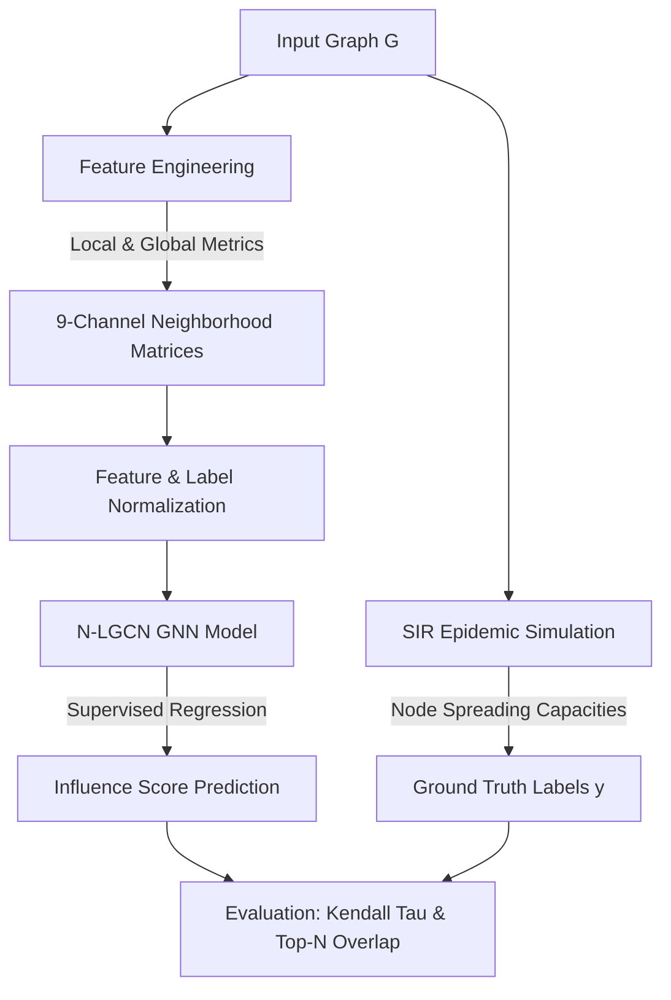

# Methodology Documentation: Influential Node Detection using N-LGCN

This document outlines the detailed methodology, dataset characteristics, algorithmic flow, and training/testing setups utilized in the Neighborhood-Local-Global Graph Convolutional Network (**N-LGCN**) pipeline for identifying influential nodes in complex networks.

---

## 1. Algorithmic Flow & Methodology

The N-LGCN framework converts graph-structured data into grid-like (image) representations for local neighborhood subgraphs, allowing a 2D Convolutional Neural Network (CNN) with Channel Attention to learn spatial and topological features for ranking node influence.

### Step 1: Preprocessing & Graph Loading
* Graphs are loaded as **undirected, unweighted networks**.
* Preprocessing automatically removes self-loops to prevent artificial inflation of local connectivity.

### Step 2: Ground Truth Label Generation (SIR Simulation)
To measure the true spreading capacity of each node, a stochastic **Susceptible-Infected-Recovered (SIR)** model simulation is conducted:
* **Seed Node:** Each node $i \in V$ is individually designated as the single initial infected node (patient zero).
* **Epidemic Threshold ($\beta_c$):** The critical infection threshold is calculated based on the network's first and second moments of degree distribution:
  $$\beta_c = \frac{\langle k \rangle}{\langle k^2 \rangle - \langle k \rangle}$$
* **Infection Probability ($\beta$):** Set to $\beta = 1.5 \times \beta_c$ to operate above the epidemic threshold and ensure disease propagation.
* **Recovery Probability ($\mu$):** Set to $\mu = 1.0$ (infected nodes recover in 1 step).
* **Robustness:** For each node, the simulation runs **500 times**, and the average number of recovered nodes (total infection footprint) serves as the ground truth influence label $y_i$.

### Step 3: Feature Extraction (9 Channels)
For each node, we extract structural features to capture local, intermediate, and global network positions. The 9 channels represent feature-embedded adjacency matrices of size $(L+1) \times (L+1)$ (where $L=40$ is the neighborhood size limit).

* **Channel 1 (NLI):** Node Local Influence, capturing connectivity within a 3-hop radius:
  $$\text{NLI}_i = \frac{k_i \log_{10}(N_{3\text{-hop}})}{|V|}$$
* **Channel 2 ($W_{\text{NLI}2}$):** 2nd-order multi-scale aggregation: $W_{\text{NLI}2} = \text{NLI} + A \cdot \text{NLI}$ (where $A$ is the adjacency matrix).
* **Channel 3 ($W_{\text{NLI}3}$):** 3rd-order multi-scale aggregation: $W_{\text{NLI}3} = W_{\text{NLI}2} + A \cdot W_{\text{NLI}2}$.
* **Channel 4 (NGI):** Node Global Influence, capturing global path distance decay:
  $$\text{NGI}_i = \sum_{j \neq i} \frac{\sqrt{k_j + \alpha}}{d_{ij}}$$
  *(where $d_{ij}$ is the shortest path length and $\alpha = 0.5$ is a balancing factor).*
* **Channel 5 ($W_{\text{NGI}2}$):** 2nd-order global aggregation: $W_{\text{NGI}2} = \text{NGI} + A \cdot \text{NGI}$.
* **Channel 6 ($W_{\text{NGI}3}$):** 3rd-order global aggregation: $W_{\text{NGI}3} = W_{\text{NGI}2} + A \cdot W_{\text{NGI}2}$.
* **Channel 7 (Component Size):** Log-normalized connected component size for node $i$.
* **Channel 8 (Closeness Centrality):** Normalized closeness centrality.
* **Channel 9 (Coreness):** Normalized K-Shell/Core number.

### Step 4: Neighborhood Matrix Construction
For each target node $i$:
1. Select its neighbors and sort them in descending order of their importance score ($W_{\text{NLI}3}$).
2. Take the top $L$ ($L=40$) sorted neighbors. If a node has fewer than $L$ neighbors, the list is padded with `None`.
3. Construct an adjacency matrix $A^{(i)}$ of size $(L+1) \times (L+1)$ representing the subnetwork formed by node $i$ and its top $L$ neighbors.
4. For each channel $c \in \{1, \dots, 9\}$, embed the feature values into the adjacency matrix using the rule:
   * Diagonal elements $(k, k)$ hold the feature value of node $k$.
   * Off-diagonal elements $(0, k)$ and $(k, 0)$ hold the feature value of neighbor $k$ if an edge exists.
   * Other elements $(j, k)$ hold the raw adjacency binary connection ($0$ or $1$).
5. Stack the 9 embedded matrices to form a tensor $X_i \in \mathbb{R}^{9 \times 41 \times 41}$.

---

## 2. Dataset Characteristics

The project makes use of **14 training datasets** and **3 test datasets** spanning diverse domains.

### Training Datasets (14 Networks)

| Dataset | Nodes ($V$) | Edges ($E$) | Avg. Degree | Density | Clustering | Domain & Representation |
| :--- | :---: | :---: | :---: | :---: | :---: | :--- |
| **cypedge.txt** | 65 | 503 | 15.48 | 0.2418 | 0.5653 | Protein-protein/ecological interactions in cyanobacteria. |
| **carrib.txt** | 249 | 3,492 | 28.05 | 0.1131 | 0.4002 | Food web of Caribbean reef (Nodes: species; Edges: trophic links). |
| **C_elegans.txt** | 297 | 2,148 | 14.46 | 0.0489 | 0.2924 | Neural network of *C. elegans* (Nodes: neurons; Edges: synapses). |
| **Budapest.txt** | 480 | 989 | 4.12 | 0.0086 | 0.3004 | Human connectome network (Nodes: brain regions; Edges: fiber tracts). |
| **US_airports.txt** | 500 | 2,980 | 11.92 | 0.0239 | 0.6175 | US commercial aviation network (Nodes: airports; Edges: flight paths). |
| **Human12a.edge** | 501 | 6,038 | 24.10 | 0.0482 | 0.5399 | Human metabolic/PPI network (Nodes: proteins; Edges: interactions). |
| **synthetic_fragmented_1** | 471 | 935 | 3.97 | 0.0084 | 0.2434 | Synthetic network designed with highly modular/fragmented sub-structures. |
| **cargoshipsBB.txt** | 834 | 4,349 | 10.43 | 0.0125 | 0.4170 | Cargo shipping web (Nodes: ports; Edges: shipping voyages). |
| **synthetic_fragmented_2** | 965 | 1,966 | 4.07 | 0.0042 | 0.2513 | Large synthetic fragmented modular network. |
| **E.coli.edge** | 1,100 | 3,637 | 6.61 | 0.0060 | 0.4571 | Transcription regulation of *E. coli* (Nodes: genes; Edges: regulation). |
| **netscience.mtx** | 1,461 | 2,742 | 3.75 | 0.0026 | 0.6937 | Co-authorship of network scientists (Nodes: authors; Edges: paper co-authorship). |
| **open_flights.txt** | 2,939 | 15,677 | 10.67 | 0.0036 | 0.4526 | OpenFlights global routes (Nodes: airports; Edges: flight connections). |
| **out.advogato** | 6,539 | 39,285 | 12.02 | 0.0018 | 0.1953 | Advogato online community (Nodes: users; Edges: trust certifications). |
| **out.foldoc** | 13,356 | 91,471 | 13.70 | 0.0010 | 0.3379 | Free Online Dictionary of Computing (Nodes: terms; Edges: cross-references). |

### Test Datasets (3 Networks)

| Dataset | Nodes ($V$) | Edges ($E$) | Avg. Degree | Density | Clustering | Domain & Representation |
| :--- | :---: | :---: | :---: | :---: | :---: | :--- |
| **NewSpain_18c_travelmap.gml** | 230 | 245 | 2.13 | 0.0093 | 0.0559 | Historic 18th-century travel routes in New Spain (Nodes: towns/parishes; Edges: roads). |
| **mammalia-voles-bhp-trapping.edges** | 1,686 | 4,623 | 5.48 | 0.0033 | 0.4613 | Animal physical contact network (Nodes: voles; Edges: trapping encounters). |
| **facebook_combined.txt** | 4,039 | 88,234 | 43.69 | 0.0108 | 0.6055 | Facebook social circle network (Nodes: users; Edges: friendships). |

---

## 3. Details of Training & Testing

### Model Architecture
The network is a custom 2D Convolutional Neural Network (CNN) containing:
1. **Channel Attention Module:** Learns inter-channel relationships to dynamically scale the input channels (9 channels) using a reduction ratio of 3.
2. **2D Convolutional Layer:** `Conv2d(in_channels=9, out_channels=16, kernel_size=2)`.
3. **Batch Normalization & Activation:** `BatchNorm2d(16)` followed by `ReLU` activation.
4. **Max Pooling:** `MaxPool2d(kernel_size=2)` reducing the dimensional size.
5. **Fully Connected Layers:** `Linear(16 * 20 * 20 -> 8)` with `ReLU`, followed by a final regression head `Linear(8 -> 1)` outputting a scalar score.

### Training Details
* **Device:** CUDA-enabled GPU (falls back to CPU).
* **Data Aggregation:** The tensors from all 14 training networks are concatenated.
* **Input Normalization:** Mean-std normalization calculated globally per channel over all combined training samples to prevent leakage.
* **Label Normalization:** Log-simulation outcomes are z-score normalized.
* **Epochs:** 300 epochs.
* **Batch Size:** 256.
* **Optimizer:** Adam (Learning Rate = 0.001).
* **Loss Function:** Mean Squared Error (MSE) loss.

### Testing & Evaluation Details
When testing on a new unseen graph (e.g., Facebook, Voles, or New Spain):
1. **Feature Extraction:** Pre-calculate the 9 channels of structural features.
2. **Inference:** Pass features through the trained model using training statistics (`X_mean`, `X_std`) for normalization to predict scalar influence scores.
3. **Ground Truth:** Run parallel SIR simulations (500 iterations per node) to obtain true spreading scores.
4. **Analysis Metrics:**
   * **Kendall's Tau ($\tau$):** Measures rank correlation between model predictions and SIR ground truth, as well as model predictions vs. traditional centralities.
   * **Baseline Comparison:** Compare GNN accuracy against traditional centrality methods:
     * Degree Centrality
     * Closeness Centrality
     * Betweenness Centrality
     * PageRank Centrality
     * Coreness (K-core)
     * Eigenvector Centrality
   * **Top-15 Node Overlap:** Compares the intersection size of the Top-15 nodes predicted by the model vs. those produced by the SIR simulations.
